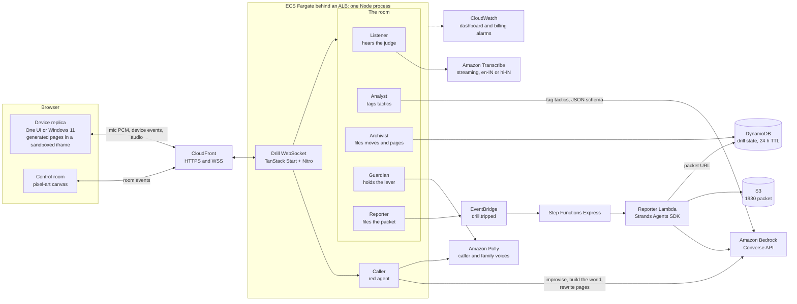
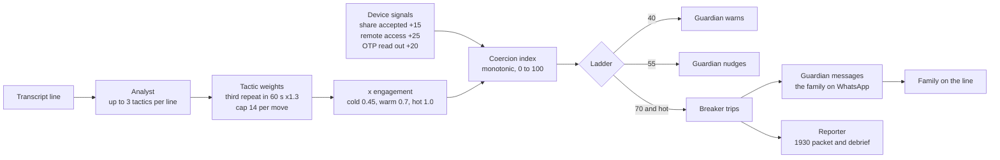

# Circuit Breaker

**A real-time coercion detection engine for live scams against vulnerable people.**

Every anti-scam product in India watches the phone number. None of them hears the conversation. Circuit Breaker scores a live session for coercion and trips a breaker that puts someone you trust between you and the caller. This repo is the hackathon build: a drill simulator where you get scammed, safely. A synthetic AI caller runs a real playbook against you on a faithful Android (One UI) or Windows 11 replica, while five pixel-art agents in a control room score the same conversation and trip the breaker. The engine is not mocked. The caller is.

Built for WeMakeDevs x AWS "First Commit", 18 to 20 September 2026.

## Try it

Deployed: see the submission link.

Local, no AWS account needed:

```bash
npm install
npm run dev              # http://localhost:3000
```

Optional installs that make local mode fully live:

```bash
tools/piper/install.sh   # Piper voices (en, hi) for the caller and Vosk models for your mic, ~350 MB
tools/llm/install.sh     # llama.cpp + Qwen2.5-3B-Instruct so the caller improvises, ~2 GB
tools/llm/serve.sh       # serves the model on :8081; set LLM_BASE_URL and LLM_MODEL in app/.env
```

To use AWS services from your machine, copy `app/.env.example` to `app/.env` and fill in credentials and model IDs. Add `?auto=1` to a drill URL and the judge replies for you.

## How a drill works

- Pick a persona (or type one), a scam family and a device. The world builder writes that person's phone: contacts, chats, mails, bank, a hook SMS.
- The phone on the desk rings. The caller ("Mumbai Cyber Cell", "Microsoft support", a recruiter) speaks and listens. You answer by voice or by typing, in English or Hindi.
- The caller sends pages: an RBI verification form, an AnyDesk installer, a refund portal. Every button you press is a device event the caller reacts to.
- The Listener transcribes, the Analyst tags each caller line with tactics, the Archivist files moves and pages, the Guardian keeps a hand on the lever.
- The index climbs only as far as you go along. At 40 the Guardian warns, at 55 nudges, at 70 the lever drops. It cannot drop until you have gone along twice or accepted a hard device action.
- On trip the Guardian messages your guardian on WhatsApp, the caller's audio ducks, a popover from the agents tells you what just happened, and the family member comes on the line.
- The Reporter files a 1930 helpline packet. The debrief shows every move, what it cost, and the packet.
- Hard mode hides the room; only a green dot says it is watching. The debrief reveals the whole board.

## Architecture



Default models are `openai.gpt-oss-120b-1:0` for the caller and `amazon.nova-lite-v1:0` for the Analyst, world builder, generated pages and Reporter. Claude on Bedrock is a one-variable swap once the Anthropic use-case form is approved.

## The coercion engine



Engagement is cold until you go along with something, warm after one compliance or a soft device signal, hot after two compliances or a hard one (screen share, remote access, OTP read, payment). While not hot, the index holds at 69 and the Guardian says so. Weights and thresholds live in `corpus/ontology.json`.

## What runs where

| Rubric row | Service | Job |
| --- | --- | --- |
| Agents and AI | Amazon Bedrock (Converse API, optional Guardrails); Strands Agents SDK | The caller, the Analyst, the world builder, generated scam pages; the Reporter agent that drafts the 1930 packet |
| Containers | ECS on Fargate, ECR, ALB | One Node process: TanStack Start pages, API routes and the drill WebSocket (Nitro) |
| Serverless | EventBridge, Step Functions Express, Lambda | `drill.tripped` on a bus starts the packet pipeline: Reporter Lambda writes to S3, packet URL back to DynamoDB |
| Data | DynamoDB, S3 | Drill state with 24 h TTL; packets (7 day expiry) and the corpus copy |
| Voice | Amazon Transcribe streaming, Amazon Polly | The Listener; the caller's voice and the family line, English and Hindi |
| Plumbing | CloudFront, CloudWatch | HTTPS for the mic and the WebSocket edge; dashboard and billing alarms at $60, $100, $140, paired with an AWS Budget |

The `/how` page in the app is this table, interactive: hover any object in the room.

## Local vs AWS mode

| | AWS mode (`CB_MODE=aws`) | Local mode |
| --- | --- | --- |
| Caller's brain | Bedrock via Converse | Any OpenAI-compatible endpoint (`tools/llm/serve.sh`); else scripted playbook with resist branches |
| Caller's voice | Amazon Polly | Piper TTS; else browser voices; else captions |
| Your voice | Amazon Transcribe streaming | Vosk on the server; else Chrome speech recognition; else typing |
| Analyst | Bedrock tagging with a JSON schema, keyword rules as backup | Keyword rules per tactic, English and Hindi |
| World and pages | Bedrock builds the world and rewrites the whole page | Templates; the local model rewrites the page copy |
| Packet | EventBridge to Step Functions to Strands Lambda to S3 | Written in-process |

Every provider is abstracted (`app/server/lib/llm.ts`, `tts.ts`, `listener.ts`) and falls back one tier at a time, so the drill runs end to end with nothing installed.

## Deploy

```bash
npm run deploy           # cdk bootstrap first; prints the CloudFront URL
```

Docker must be running and Bedrock model access enabled for the two models. Region, model and CloudFront (`CB_EDGE=0` for an unverified account) options, cost per drill, updating and teardown are in [docs/DEPLOY.md](docs/DEPLOY.md).

## Repo layout

```
app/                TanStack Start app
  src/routes/         pages and API routes
  src/room/           the control room: canvas, sprites, store
  src/devices/        One UI and Windows 11 replicas, agents popover
  server/lib/         engine: session, analyst, guardian, archivist, reporter, redAgent, listener, tts, llm, uiSteps
  server/routes/ws.ts the drill WebSocket
corpus/             five playbooks, four personas, the ontology, base HTML pages
infra/              CDK stacks and the Strands Reporter Lambda
tools/              local voice (Piper, Vosk) and local model (llama.cpp) installers
docs/               PRD and deploy guide
```

## Safety

The caller is fictional, sandboxed with a system prompt and optional Bedrock Guardrails, and never touches real payment rails, organisations, numbers or credentials. No real money can move. No recordings are kept. App names and interfaces are reproduced for realism only; no affiliation with WhatsApp, Google, Microsoft, AnyDesk, PhonePe or any bank.

## Licence

Apache-2.0.
