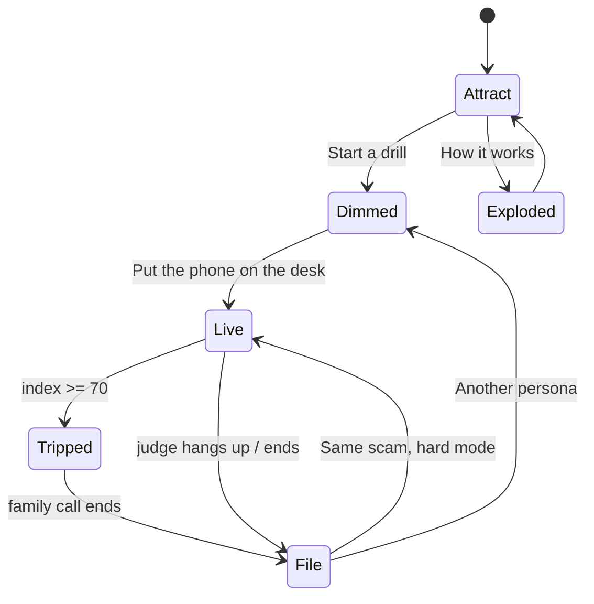
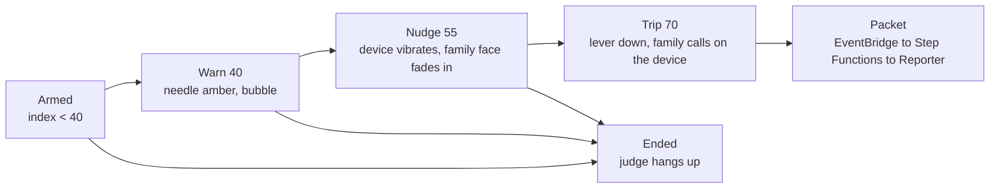
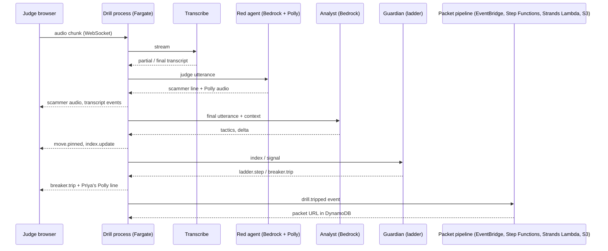

# Circuit Breaker PRD

As of 2026-09-19

## Thesis

**Circuit Breaker: A Real-Time Coercion Detection Engine for Live Scams Against Vulnerable People.**

Every anti-scam product in India watches the phone number. Airtel and Jio score callers at the network layer, Truecaller scores reputation, DoT's Fraud Risk Indicator scores numbers for banks. None of them hears the conversation. Digital-arrest, fake-job, loan-app and trading-group scams all work by coercion inside a live session, often on WhatsApp, often with the victim calling back. Google's on-device detection hears content but only on Pixel 9 and Galaxy S26. WhatsApp told the Supreme Court that a time-based kill switch "does not address the underlying coercion." We built the thing that does.

The engine takes a live transcript plus session signals, scores coercion in real time against a tactic ontology, and trips a breaker that puts a family member between the victim and the scammer. It is channel-agnostic: a WhatsApp video call, a Meet interview, an AnyDesk session and a WhatsApp group are all live coercion sessions to it.

The hackathon deliverable is a drill simulator. Judges cannot experience a real scam, so we give them one. A synthetic scammer (the red agent) runs a real playbook against the judge on a simulated phone or laptop, while the engine (the blue agents) scores the same conversation and trips the breaker. The engine is not mocked. The scammer is.

What a judge experiences in the first 60 seconds:

1. Lands on a pixel-art control room with five agents idling. Headline: "Get scammed. Safely."
2. Picks a persona (or types one) and a scam family. Bedrock builds that person's phone: contacts, SMS, bank, a recent parcel.
3. The phone on the desk rings. The camera pushes in, the phone lifts. "Mumbai Cyber Cell" is on video and knows about the parcel.
4. They talk. The needle on the wall climbs. The Analyst pins "ISOLATION" to the cork board.
5. The lever slams down. The phone on the desk lights up with the "daughter" calling, her voice from Polly.

Everything happens in one room. Every page is a state of it.

## The experience

The site is one pixel-art control room, isometric cutaway, built once as a state machine. Pages do not navigate away from it; they set its state. The device the judge is scammed on is an object on the desk in that room.

| Page | Room state | What moves |
| --- | --- | --- |
| Landing `/` | Attract | Sprites idle-loop, bubbles rotate every 8 s, gauge at 0, lever up. Headline over the room. |
| Picker `/drill/new` | Dimmed | Room at 30%, sprites face the camera and wait. A case file on the desk, in the room's pixel style, holds the persona, case and device choices. The word scam never appears on this screen. |
| Drill `/drill/:id` | Live, device lifted | Camera pushed 30% in on the desk. Phone lifted into the left 600 px, room live in the right 840 px. Needle, board cards, bubbles, lever armed. Laptop variant: device takes 900 px, room compresses to a 540 px strip showing the wall. |
| Trip (same route, state) | Tripped | Lever slams down, one red flash, Guardian runs to the phone booth, Reporter slides the packet, scammer audio ducks to 20%. Device shows the family face and one green button. |
| Debrief `/drill/:id/debrief` | Reporter's file | Camera on the desk. A paper report slides in: stamp, moves survived, stickers. Tape recorder on the desk is the replay scrubber. Polaroid is the share card. |
| How it works `/how` | Exploded | Room at full size, everything but the hovered object dimmed. Hover shows the AWS service card and lights the legend row. |

The camera transition is one move of about 1.2 s and no route change. The phone on the desk rings and glows; the scene's CSS transform pushes toward the desk; the phone element animates from its desk anchor to the drill anchor, rotating upright and scaling; the left third darkens under it. Ending a drill reverses it and the debrief paper slides in. The laptop opens its lid as it lifts. Reduced motion preference gets a hard cut.

Hard mode hides the room entirely: only the device and a small green dot reading "the room is watching." Trip and debrief fire exactly as normal, and the debrief reveals the room, whole board at once. Hard mode is what makes ending C (you leaked) possible.

Reading: every arrow is a state change on the same scene. The only two things that ever enter or leave the room are the lifted device and the paper report.

## Personas and scam families

Scope is vulnerable people, not elders. The presets span 19 to 68 and the free-text persona can be anyone. The device follows the scam, not the persona.

| Persona | Context Bedrock is given | Default scam | Device | Guardian label |
| --- | --- | --- | --- | --- |
| Kamala, 68 | Retired teacher, Mysuru. Son Rohan in Dubai, daughter Priya in Bengaluru. Ordered a phone on Flipkart last week. SBI savings ₹4,21,300. | Digital arrest | Phone | Family |
| Arjun, 19 | First-year student, Kota. Applied to 40 internships. ₹2,100 in the account. Father is a farmer. | Fake job or internship | Laptop | Buddy |
| Rehana, 34 | Garment worker, Bengaluru. Took an ₹8,000 loan-app loan, repaid it. Husband works nights. | Loan app KYC | Phone | Family |
| Meera, 45 | Widowed in March, Indore. Has the ₹12 lakh insurance payout. Joined a stock-tips group from a Facebook ad. | Trading group | Phone | Family |
| Your own | Free text, up to 300 characters. Example: "I'm 22, just moved to Pune for a BPO job, mother is sick." | Surprise me | Follows scam | Family |

The world builder is one Bedrock call at picker time, structured output, about 6 s, cached for the drill. From the persona text it produces: 8 to 12 contacts with one designated guardian and their number, a 20-message SMS history including one hook (a parcel notification, a job-portal confirmation, a loan-app reminder, a group-invite link), a bank balance and last five transactions, installed apps, a language preference, and a family name the red agent may drop. The red agent's brief is built from the same world, which is why the scammer knows about the parcel.

| Scam family | Channel simulated | Device | Opening move | Red agent win conditions | Signature tactics |
| --- | --- | --- | --- | --- | --- |
| Digital arrest | Chat video call from a non-contact | Phone | "A parcel in your name was seized at Mumbai customs." | OTP read out, screen shared, or 10 min on the line | Authority, isolation, fear, control, payment steering |
| Tech support | Browser scare pop-up, then a call and a remote-access prompt | Laptop | "Your PC is sending data to hackers right now." | Remote session accepted, refund overpayment returned | Urgency, control, reciprocity |
| Fake job or internship | Meet interview, mail with offer letter, typo-squat careers site | Laptop | "Congratulations, final round. There is a refundable deposit." | Deposit paid, documents shared on screen | Personalisation, scarcity, authority |
| Loan app KYC | Call plus SMS with a link, then a contact-scraping permission prompt | Phone | "Your KYC failed; your loan defaults tonight." | Link opened and permissions granted, payment made | Fear, urgency, threat to contacts |
| Trading group | WhatsApp-style group with fake members, then a private chat | Phone | Fake members post withdrawals; mentor DMs a slot | "Tax" paid before withdrawal, more money added | Social proof, scarcity, isolation ("SEBI rules"), reciprocity |
| Surprise me | Any of the above | Follows scam | Picked at start, hidden from the judge | As above | As above |

Each family is a playbook in the Archivist's cabinet: ordered phases, the tactic each phase leans on, the branch to take when the victim resists, and the win conditions. The corpus ships in the repo as JSON, fictional names, real structure.

## The engine

The engine turns a live session into one number, the coercion index, and acts on it through a ladder. It is the product; the room is how you see it.

**Coercion ontology.** Eight tactics, each with a base weight. The Analyst tags every scammer utterance with zero or more of them.

| Tactic | What it looks like | Base delta |
| --- | --- | --- |
| AUTHORITY | Claims to be police, CBI, RBI, SEBI, Microsoft, HR | +8 |
| PERSONALISATION | Uses a fact from the victim's world (parcel, loan, application) | +6 |
| FEAR | Arrest, jail, account freeze, job loss, contacts told | +10 |
| ISOLATION | "Don't tell anyone", "SEBI rules", "stay on the line" | +15 |
| URGENCY / SCARCITY | Countdown, "slot closes", "others waiting" | +8 |
| CONTROL | Screen share, remote access, "don't hang up", "don't restart" | +12 |
| PAYMENT STEERING | OTP, UPI, deposit, tax before withdrawal | +18 |
| RECIPROCITY | Fake refund, overpayment, "we already helped you" | +7 |

**Index math.** Index starts at 0 per drill and is monotonic within a session, because coercion is cumulative. Each tagged utterance adds the sum of its tactics' base deltas, multiplied by 1.5 if the same tactic repeats within 60 s (escalation), and by 1.25 if the Archivist's playbook match is above 80%. Session signals add fixed amounts. Clamp at 100. Thresholds: 40 warn, 55 nudge, 70 trip. Thresholds are per drill constants so the demo is predictable; they are not tuned live.

**Session signals.** These need no audio. They are emitted by the device shell and are the reason the engine still works when the Listener hears nothing.

| Signal | Emitted by | Delta |
| --- | --- | --- |
| Call or meeting with a non-contact passes 3 min | Device | +8 |
| Screen-share request shown | Device | +10, +15 if accepted |
| Remote-access tool launched or session accepted | Device | +25 |
| OTP SMS arrives while a session is live | World builder | +12 |
| Bank or UPI app opened while a session is live | Device | +10 |
| Group joined via link and "don't discuss outside" seen | Device and Analyst | +10 |
| Typo-squat or scare page opened | Device | +8 |

**Five agents.** Each is a service behind an object in the room. Each emits room events the scene subscribes to.

| Agent | Object | Service | Input | Emits |
| --- | --- | --- | --- | --- |
| Listener | Headphones desk | Transcribe streaming, hi-IN, kn-IN, ta-IN, en-IN, partial results on | Mic audio, both sides | `transcript.partial`, `transcript.final` with speaker tag |
| Analyst | Cork board | Bedrock, Claude, structured output, Guardrails | Each final utterance plus last 6 turns | `move.pinned` {tactics, delta, quote}, `index.update` |
| Archivist | Filing cabinet | Bedrock Knowledge Base on OpenSearch Serverless over the corpus | Rolling transcript | `playbook.match` {family, phase, score, next expected move} |
| Guardian | Phone booth | In-process ladder; on trip, Polly speaks the family line on the device and an EventBridge event starts the packet pipeline | `index.update`, `signal.fired` | `ladder.step`, `breaker.trip`, `family.called` |
| Reporter | Printer | Strands agent in a Python Lambda, run by Step Functions, writes to S3 | Everything above | `packet.progress`, `packet.ready` with presigned URL |

**The ladder.** Guardian runs one Step Functions execution per drill and advances on thresholds.

Reading: the ladder only moves forward. The Archivist's "next expected move" lets the Analyst pre-tag an utterance the moment the partial transcript matches it, which is what makes the board card land within a second of the scammer saying the line.

## The red agent

The scammer is a Bedrock-driven voice agent running a playbook from the corpus, adapting to what the judge says, and trying to hit its win conditions before the breaker trips. It is the only synthetic part of the demo, and it is sandboxed harder than anything else.

**Voice path.** Transcribe streaming for the judge's speech, Claude on Bedrock for the reply, Polly neural for the voice (Kajal for Indian English, Hindi neural voices for Hindi lines). Turn latency target is under 2.5 s. Nova Sonic speech-to-speech is not in this build; it is the upgrade path once the drill works. For the trading-group case the agent writes messages instead of speaking, with fake member accounts posting on a timer.

**Brief.** At drill start the agent receives: the playbook for the scam family, the persona's world (so it can mention the parcel, the loan, the application), the guardian's first name (to say "don't tell Priya"), a phase timer, and its win conditions. It never receives the judge's real phone number or anything typed into the picker beyond the persona text.

**Playbook execution.** A playbook is ordered phases: hook, authority, fear, isolation, control, extraction. Each phase has a goal, two or three scripted openers, and a resist branch. The agent stays in a phase until its goal is met or the phase timer expires, then escalates. If the judge pushes back, it takes the resist branch ("I understand, madam, but the warrant is already issued"), which is itself a tagged move. Win conditions end the drill on ending C only in hard mode; with the room visible the breaker always gets there first, by design.

**What it must never do.** Bedrock Guardrails plus a system prompt enforce all of these, and the drill ends if any is violated:

- No real organisations named as the caller beyond the generic ones the playbook allows ("Cyber Cell", "Microsoft support", "HR"). No real officer names, case numbers, phone numbers, URLs or bank names.
- Never asks for real credentials. The only OTP that exists is the one the world builder generated into the fake Messages app.
- Never produces instructions that would help someone run a real scam beyond the lines already in the public corpus. Judges asking "how would you actually do this" get a refusal in character.
- Conversation cap of 12 minutes, then the phase timer forces extraction and the breaker trips.
- Stops the instant the drill ends. No memory across drills.

A one-line disclosure sits on the picker and in the debrief: fictional scenario, no real money, no recordings kept.

## Device simulation

The browser fakes two devices with real visual language and generic names. Fidelity of the device is what makes the scam land; the room can be charming because the phone is not.

| Shell | Look | Apps | Used by |
| --- | --- | --- | --- |
| Android phone | One UI style: status bar, gesture bar, notification shade, quick settings | Chat (calls, video calls, groups, screen share), Messages, Bank, UPI, Contacts | Digital arrest, loan app, trading group |
| Windows laptop | Windows 11: taskbar, window manager with drag and focus, notification toasts | Meet-style video, Mail, Browser with tabs, Bank site, remote-access prompt | Tech support, fake job |

Both shells are one React component tree with a `device.event` bus. Anything the judge does that matters to the engine is an event: app opened, share accepted, remote session accepted, OTP toast tapped, pay button clicked, call ended. The world builder injects notifications through the same bus, so the OTP arriving mid-call is just an event with a timestamp.

**Audio.** The judge's mic is captured with `getUserMedia`, 16 kHz mono, chunked at 100 ms, sent over the drill WebSocket. Scammer audio comes back as PCM chunks and plays through Web Audio, with a gain node the Guardian ducks to 20% on trip. Echo is avoided because the scammer never hears itself: the Listener stream carries the judge's mic only, and the scammer's own lines are appended to the transcript as text from the agent, not re-transcribed.

**Video.** The scammer's face is a canvas avatar: a still portrait per scam family with amplitude-driven mouth movement, a fake badge or logo overlay, a webcam-style vignette, and a frame drop every few seconds for realism. No generated video.

**Typed fallback.** A judge with no mic, or in a quiet room, can toggle to typed replies. The scammer still speaks; the Listener consumes the text directly. Everything else is identical.

**iOS.** Not simulated for the hackathon. Android is 96% of Indian phones, the scam scripts are identical, and a second phone shell buys nothing for judging. The decision to revisit later is noted in the risks section.

## Stack and AWS architecture

One app, one process. TanStack Start on Vite with React 19 and TypeScript, Nitro Node target. File routes serve the pages, `server.handlers` in the same route tree serve the API, and a Nitro `defineWebSocketHandler` carries the drill stream: audio up as binary frames, room events down as JSON. TanStack Query for REST, zustand for the live room store. Plain CSS with a token file, since the pixel UI and the OS replicas need exact values.

Region is ap-south-1 (Mumbai). Hosted on ECS Fargate behind an Application Load Balancer, with CloudFront in front for HTTPS (the mic needs a secure origin) and for the WebSocket. App Runner was rejected because it does not carry WebSockets. Image in ECR, stack in CDK under `infra/`. No NAT gateway: the task runs in a public subnet with a public IP.

The hackathon's track table is the rubric, so each row it lists maps to a service doing a real job:

| Rubric row | Used | Role |
| --- | --- | --- |
| Agents and AI | Strands Agents SDK on Bedrock; Bedrock Converse | The Reporter is a Strands agent in a Python Lambda that assembles the 1930 packet. Red agent, Analyst and world builder call Bedrock directly. |
| Containers | ECS on Fargate, ECR | The drill process with its WebSocket |
| Serverless | Lambda, Step Functions, EventBridge | On trip or end, the process puts an event on a bus; a rule starts a Step Functions execution that runs the Reporter, writes the packet to S3 and the URL to DynamoDB |
| Servers and runtimes | not used | Fargate covers hosting |
| Data and search | DynamoDB, S3 | Drill state with 24 h TTL; packets and the corpus copy |
| Auth and policy | not used, stretch | Cognito identity pool for direct browser-to-Transcribe streaming |
| The plumbing | CloudFront, EventBridge, CloudWatch | HTTPS and WebSocket edge; event bus; latency metrics and billing alarms |

| Service | Role in the drill | Local mode (no keys) |
| --- | --- | --- |
| Bedrock, Claude Sonnet via Converse | The red agent's every line; one env switch moves it to Nova Pro if spend runs high | Scripted lines from the corpus |
| Bedrock, Claude Haiku 4.5 via Converse | The Analyst's coercion tagging with a JSON schema; the world builder | Keyword rules; persona templates |
| Bedrock Guardrails | Attached to the red agent so it stays fictional | Prompt-only safety |
| Amazon Transcribe streaming | The Listener, en-IN and hi-IN, partial results on, streams only while the mic detects speech | Browser speech recognition, else typed |
| Amazon Polly | The scammer's voice, and Priya's line on trip | Browser speech synthesis |
| Strands Agents on Lambda | The Reporter | Packet built in-process |
| Step Functions, EventBridge | The packet pipeline | Direct call |
| Amazon DynamoDB | Drill, world, utterances, moves, signals, trip; single table, 24 h TTL | In-memory map |
| Amazon S3 | The 1930 evidence packet with a presigned download; the corpus copy | Served from the process |
| ECS on Fargate, ALB, CloudFront, ECR | Hosts and fronts the Node process | `node .output/server/index.mjs` |
| CloudWatch | Per-stage latency metrics, one dashboard, billing alarms at $60 and $80 | Console logs |
| AWS CDK | VPC, cluster, service, ALB, distribution, table, bucket, bus, state machine, Lambda, roles | Not used |

Stretch, only after the full drill works end to end: Bedrock Knowledge Base on OpenSearch Serverless for the Archivist (skipped for cost, about $12 a day minimum), Step Functions for the Guardian ladder itself, Cognito. The How it works page labels these honestly as in-process for the demo.

**Data flow.**

Reading: the drill process is the only thing that talks to everyone, and the browser only ever sees events.

**Latency budget, utterance to card on the board.**

| Stage | Target |
| --- | --- |
| Mic chunk to Transcribe partial | 300 to 800 ms |
| Final utterance to Analyst response | 700 to 1,000 ms |
| Event to room animation start | under 100 ms |
| Total | under 2 s |
| Red agent turn (Transcribe, Bedrock, Polly) | under 2.5 s |
| Trip to Priya on the device | under 1 s |
| Trip to packet ready | under 15 s, covered by the printer animation |

**Budget.** About $65 of the $100 credit for 150 Bedrock drills and 100 Transcribe drills including testing, at list prices. Lambda, Step Functions, EventBridge and CloudFront add under a dollar at this volume. The rules that keep it there: UI development and testing in local mode; Transcribe streams only while the mic is hot; no NAT gateway; no Knowledge Base; a drill cap of 200 in the server; billing alarms at $60 and $80.

## Data model, APIs and events

One DynamoDB table, partition key `drillId`, sort key by entity and timestamp, TTL 24 hours. Nothing about a judge persists past the day.

| Entity | Key fields | Notes |
| --- | --- | --- |
| Drill | id, personaId or personaText, scamFamily, device, hardMode, ringPhone, startedAt, endedAt, ending | ending is A, B or C |
| World | contacts\[\], guardian {name, number}, smsThread\[\], bank {balance, txns\[\]}, apps\[\], language, hook | Generated once by Bedrock |
| Utterance | ts, speaker (judge or scammer), text, lang, partial | Listener output |
| Move | ts, tactics\[\], delta, quote, phase, playbookScore | Analyst output, one board card |
| Signal | ts, kind, delta, source | Device or world builder |
| LadderStep | ts, from, to, index | Guardian output |
| Trip | ts, index, contactId, channel (device), status | One per drill at most |
| Packet | ts, s3Key, presignedUrl, expiresAt | Reporter output |

**REST.**

| Method and path | Does |
| --- | --- |
| `POST /drills` | Body: persona, scam, device, hardMode, phone (optional). Builds the world, starts the ladder, returns drillId and a WebSocket ticket. |
| `GET /drills/:id` | Drill, world (guardian name only), current index, ladder state. |
| `POST /drills/:id/device-events` | Batched `device.event` items when the WebSocket is down. |
| `POST /drills/:id/end` | Ends the session, decides the ending, triggers the Reporter. |
| `GET /drills/:id/debrief` | Moves, signals, ladder, trip, packet URL, comparison to the average victim. |

**WebSocket, server to room.** The scene subscribes to these and nothing else; every animation is a reaction to one of them.

| Message | Payload | Room reaction |
| --- | --- | --- |
| `transcript.partial` | speaker, text | CRT ticker updates |
| `transcript.final` | speaker, text, lang | CRT line commits |
| `move.pinned` | tactics, delta, quote | Analyst walks to the board, card lands |
| `index.update` | index, delta | Needle moves |
| `playbook.match` | family, phase, score, next | Archivist pulls a file, bubble text |
| `signal.fired` | kind, delta | Amber flash on the gauge, bubble |
| `ladder.step` | from, to | Guardian's hand on the lever, bubble |
| `breaker.trip` | index, channel | Lever down, flash, Guardian to booth |
| `family.called` | status | Booth phone off the hook |
| `packet.progress` / `packet.ready` | percent / url | Printer pages, then packet slides |
| `world.notification` | app, title, body | Toast on the device |
| `scammer.audio` | pcm chunk | Playback |
| `agent.state` | agent, state, bubble | Idle, walk, act; bubble text |

**WebSocket, room to server.** `audio.chunk` (pcm), `text.reply` (typed fallback), `device.event` {kind, app, detail}, `drill.end`.

Every message carries `drillId`, `seq` and `ts`. The room ignores out-of-order `seq` for the same agent, so a slow Analyst never makes a sprite walk backwards.

## Build plan

Seven workstreams, one integration point: the drill WebSocket. Everything is built against the event contract above from hour one, so the room can be developed against a replayed event log while the engine is still being wired.

| Workstream | Builds | Depends on | Owner |
| --- | --- | --- | --- |
| A · Room | Scene, five sprite sheets (idle, walk, one action), gauge, lever, board, CRT, camera transform, state machine, bubble system | Event contract | team |
| B · Device shells | Android and Windows shells, the apps per scam, `device.event` bus, audio capture and playback, avatar canvas, typed fallback | Event contract | team |
| C · Engine | Orchestrator on Fargate, Listener, Analyst with schema and Guardrails, Archivist KB, Guardian ladder, Reporter agent | Corpus (F), infra (E) | team |
| D · Red agent | Nova Sonic session, playbook runner, brief builder, resist branches, Guardrails, fallback path | Corpus (F), infra (E) | team |
| E · Infra | CDK: VPC with public subnets and no NAT, ECS Fargate service, ALB, CloudFront, ECR, DynamoDB, S3, EventBridge bus and rule, Step Functions, the Reporter Lambda, task role, CloudWatch dashboard and billing alarms | none | team |
| F · Content | Corpus JSON for 5 families, 4 persona presets, world-builder prompt, coercion schema, all UI copy in en and hi | none | team |
| G · Video and write-up | Script, screen captures, the recorded phone ringing, Devpost write-up in the winners' structure | Everything | team |

Order of work and what must exist at each checkpoint. Times are IST.

- [ ] **Fri 18 Sep, midnight.** E: CDK stack deployed, CloudFront URL live with a placeholder. C: mic to Transcribe to transcript on screen, in the browser, on the live URL. F: corpus schema agreed and the digital-arrest playbook written. A: the reference render sliced into layers; sprite style locked.
- [ ] **Sat 19 Sep, noon.** D: the red agent talks back on the digital-arrest playbook, Nova Sonic or fallback decided. C: Analyst pins moves, index updates, events on the WebSocket. B: Android shell with Chat video call and Messages, OTP toast injected. A: room reacts to a replayed event log.
- [ ] **Sat 19 Sep, 20:00.** Full drill end to end on the live URL: picker, world built, phone lifted, call, moves on the board, lever, debrief paper. Guardian ladder live. Priya's Polly line plays on trip. Packet pipeline writes to S3.
- [ ] **Sat 19 Sep, midnight.** Windows shell with Meet, Mail, Browser and the remote-access prompt. Fake-job and tech-support playbooks. Hard mode. Endings A, B, C.
- [ ] **Sun 20 Sep, noon.** How it works page with hover. Loan-app and trading-group playbooks if time. Latency dashboard shows the budget met. Freeze features.
- [ ] **Sun 20 Sep, 15:00.** Video recorded and cut. Write-up done. Blog post drafted.
- [ ] **Sun 20 Sep, 17:00.** Submitted, with an hour of margin.

If the schedule slips, cut in this order: trading group, loan app, Windows shell, How it works hover (keep the static page), hard mode. Never cut: one full phone drill, the trip with Priya calling on the device, the debrief paper.

## Risks and open decisions

| Risk | Likelihood | Fallback |
| --- | --- | --- |
| Bedrock model not enabled in ap-south-1 on the account | Medium | Enable model access on Friday night; else point `BEDROCK_MODEL_ID` at us-east-1 |
| Hinglish and code-switching degrade Transcribe accuracy | High | Language ID on, English playbooks by default for judges, Hindi as an option, and the Analyst is told transcripts may be noisy |
| Judges' browsers block the mic, or the venue is loud | High | Typed fallback is a first-class mode, not an afterthought |
| Guardrails refuse the red agent's own lines | Medium | Tune the Guardrail to the corpus on Friday night; keep a permissive drill-only profile |
| Analyst latency spikes push cards past 2 s | Medium | Pre-tag from the Archivist's next expected move; show the partial card on `transcript.partial` |
| Spend runs past the estimate | Medium | Billing alarms, the drill cap, and the Nova Pro switch for the red agent |
| Sprite and room assets take longer than a day | High | Room and sprites are drawn in code at 384 by 216 and upscaled; one action pose each, walk can be a bob |
| The room reads as a game and judges miss the engine | Low | The How it works page and the debrief paper both say what each object is; the write-up leads with the engine |
| A judge treats the drill as victim-blaming | Low | Copy compares to the average victim, never to other players; ending A is celebrated |

Decisions still needed from the team:

- [ ] Title suffix: "Against Vulnerable People", "Against the People Scammers Target", or "Against Anyone Alone With a Phone".
- [ ] Surprise me randomises the device too, or only the case.
- [ ] Red agent model: Claude Sonnet for quality, or Nova Pro for cost.
- [x] No real phone call. The trip is on the device, with Priya's voice from Polly.
- [x] iOS shell stays out. Android is 96% of Indian phones and the scripts are identical.
